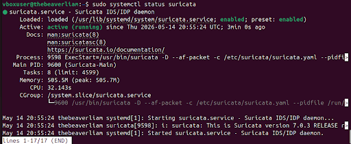
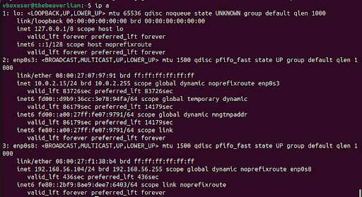
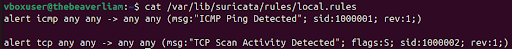
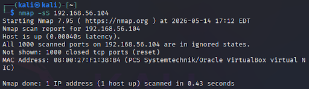
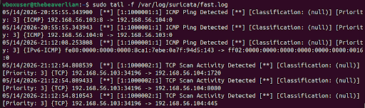
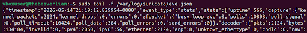
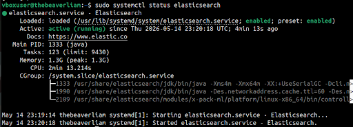
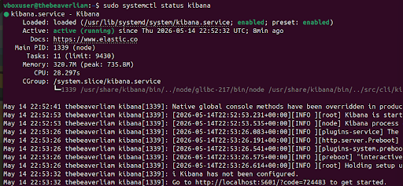
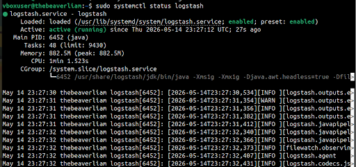
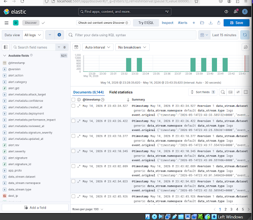

# suricata-elk-siem-lab

## Overview

This project demonstrates a home-built Security Information and Event Management (SIEM) lab using Suricata, Elasticsearch, Logstash, and Kibana (ELK Stack) to monitor and analyze simulated network attacks between virtual machines.

The lab simulates attacker behavior using Kali Linux while an Ubuntu-based Suricata sensor captures and analyzes traffic in real time. Logs are forwarded through Logstash into Elasticsearch and visualized through Kibana dashboards and Discover views.

---

## Architecture

Kali Linux (Attacker)
↓
Ubuntu + Suricata IDS
↓
eve.json Logs
↓
Logstash
↓
Elasticsearch
↓
Kibana Visualization & Search

---

## Technologies Used

- Suricata
- Elasticsearch
- Logstash
- Kibana
- Ubuntu Linux
- Kali Linux
- VirtualBox
- Nmap

---

## Objectives

- Deploy Suricata as a network intrusion detection system
- Configure custom IDS rules
- Simulate attacks using Kali Linux
- Detect ICMP and TCP scan activity
- Parse and ingest eve.json logs
- Store searchable telemetry in Elasticsearch
- Visualize alerts and events in Kibana

---

## Virtual Machine Configuration

### Ubuntu Sensor VM
- Ubuntu Server/Desktop
- Suricata IDS
- ELK Stack
- Host-only adapter: 192.168.56.x

### Kali Linux Attacker VM
- Kali Linux
- Nmap scanning tools
- Host-only adapter: 192.168.56.x

---

## Network Configuration

### Interfaces

```bash
ip a
```

The Suricata monitoring interface was configured on:

```text
enp0s8
```

---

## Suricata Configuration

### Verify Suricata Status

```bash
sudo systemctl status suricata
```

### Custom Detection Rules

```rules
alert icmp any any -> any any (msg:"ICMP Ping Detected"; sid:1000001; rev:1;)

alert tcp any any -> any any (msg:"TCP Scan Activity Detected"; flags:S; sid:1000002; rev:1;)
```

### Test Rule Configuration

```bash
sudo suricata -T -c /etc/suricata/suricata.yaml -v
```

---

## Attack Simulation

### ICMP Ping Test

```bash
ping 192.168.56.104
```

### TCP SYN Scan

```bash
nmap -sS 192.168.56.104
```

---

## Suricata Alert Monitoring

### Fast Log Monitoring

```bash
sudo tail -f /var/log/suricata/fast.log
```

Example detections:

```text
ICMP Ping Detected
TCP Scan Activity Detected
```

### Eve JSON Monitoring

```bash
sudo tail -f /var/log/suricata/eve.json
```

---

## ELK Stack Setup

### Elasticsearch

```bash
sudo systemctl status elasticsearch
```

### Kibana

```bash
sudo systemctl status kibana
```

### Logstash

```bash
sudo systemctl status logstash
```

---

## Elasticsearch Optimization

Elasticsearch initially failed due to VirtualBox memory limitations and Linux OOM (Out Of Memory) kills.

To stabilize the environment, JVM heap allocation was manually reduced.

### Heap Configuration

Created:

```bash
/etc/elasticsearch/jvm.options.d/heap.options
```

Contents:

```text
-Xms512m
-Xmx512m
```

This reduced memory usage and allowed Elasticsearch to remain stable within the virtual machine environment.

---

## Log Ingestion Pipeline

Logstash was configured to ingest:

```text
/var/log/suricata/eve.json
```

Events were parsed and forwarded into Elasticsearch for indexing.

---

## Kibana Results

Kibana successfully indexed and visualized:

- ICMP detections
- TCP SYN scan detections
- Suricata telemetry
- Flow records
- Network metadata

Over 6,000 searchable events were indexed during testing.

---

## Screenshots

### Suricata Running


### Network Interface Configuration


### Custom Suricata Rules


### Kali Nmap SYN Scan


### Suricata TCP Scan Detection


### Eve JSON Logs


### Elasticsearch Running


### Elasticsearch Optimized


### Kibana Running


### Logstash Running


### Kibana Discover View


---

## Skills Demonstrated

- Network Security Monitoring
- Intrusion Detection Systems
- SIEM Pipeline Configuration
- Log Ingestion and Parsing
- Linux System Administration
- Attack Simulation
- Threat Detection Engineering
- Kibana Data Analysis
- Virtualized Cybersecurity Labs

---

## Key Takeaways

- Built a functional SIEM pipeline using open-source tools
- Configured custom Suricata IDS rules
- Simulated attacker activity using Kali Linux
- Troubleshot Elasticsearch memory issues
- Visualized network security telemetry in Kibana
- Gained hands-on SOC and blue-team experience

---

## Future Improvements

- Build Kibana dashboards
- Add Zeek integration
- Add Sigma detection rules
- Implement alert correlation
- Add packet capture storage
- Deploy on dedicated hardware
